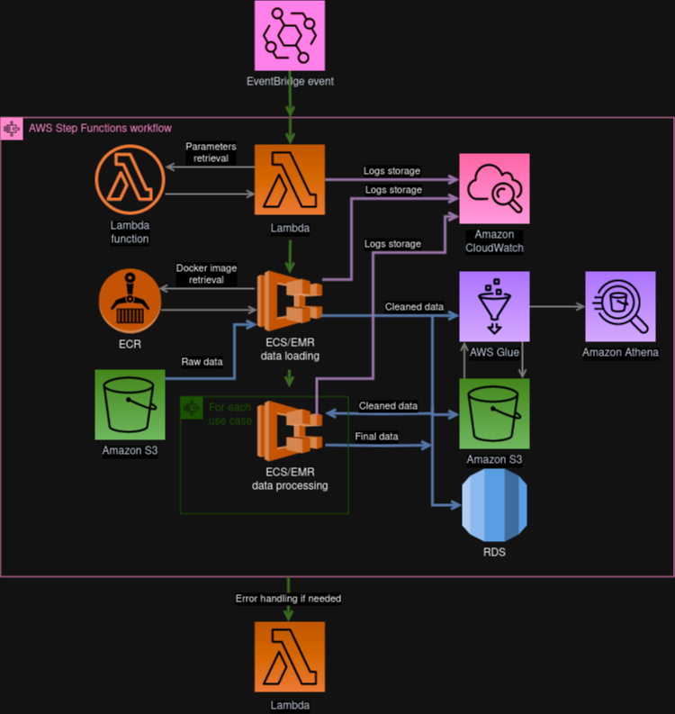

# PriceHubble Senior Data Engineer home assignment

This document, along with other files, presents the workflow chosen to answer the technical assignment.

## Workflow

The global workflow is presented in a diagram (made via [draw.io](https://www.drawio.com/)): .

It's a micro-services architecture, making every data loader/processor/ingester useable indepedently, in other pipelines if needed.

It is designed with AWS' cloud services, but the same could be done with any other cloud provider.

Bellow is detailed up the idea of this workflow:

- the ETL is triggered either manually, either automatically via AWS EventBridge. This service allows for cron-like schedule events (like every morning at 6:00 am), or other events like an API call received.
- the whole ETL is included in an AWS StepFunction. This service allows to link inputs and outputs of other AWS services, like in a DAG.
- the first step is a Lambda function. It's a lightweight piece of code, processed in a serverless way.
Here we use it to process the potential arguments given to the pipeline. The pseudo-code of this lambda can be found [here](scripts/lambda/process_args_lambda.py).
- the next step is a computing service. Its job is to retrieve raw data, stored for instance on a datalake in any format, clean it and then store it in a more structured way. Depending on the computational needs, the architecture can be serverless (Fargate), single machine (EC2 instance) or a cluster (EMR). The code used for data retrieval and cleaning is here specified in python, and encapsulated in a docker image stored on ECR. The python pseudo-code is presented [here](scripts/ecs/data_loading/data_loading_sample.py).
- then it's the use cases step. It's also a computing service, and it can include ML models and aggregations. It can be looped through several use cases. Final data, ready to be delivered to client or accessible via dashboard product, is then stored.
- there's a global lambda fallback. If there is any issue at any step, it will fall in that step. That step can be only informatory, like sending an email to developers to let them know something went wrong, or inform clients or other products like dashboard that there is an issue.

### Remarks

- the loading step and the processing step are separated for the sake of ressource management. Usually, loading uncleaned data is way heavier, because of unadapted type or fields we don't need. Also, there are potentially several use cases that need the same pre-processing, so do it once and store cleaned data is better. Cleaned data is then available for R&D too. 
- the storage service for cleaned and final data can be anything, from a datawarehouse to a relational database or an external service.
- all steps (Lambdas, ECS) can have their own retry and error handling. It's not on the diagram for the sake of clarity.
- logs of all steps are automatically stored on CloudWatch, classed by name, trigger id, hour, etc. They are accessible, and events can be triggered from them.
- the workflow can be entirely specified with AWS CDK. It's the infrastruture-as-code tool of AWS. Using this, we can beneficiate of a version-control tool like git, to keep a track of changes but also do merge reviews, comparisons, etc.

## Qestions answers

1. The design is presented in this document, in the sections above.

2. Mostly AWS CDK, Docker and Gitlab-CI. It allows for traceability, rollback to older versions, separated environments (dev, preprod, prod). Several AWS services are used, but they are inter-changeable with the other cloud providers (GCP or Azure).  

3. In this example I used Glue and Athena to store cleaned data. It ensures a format for the whole tables (the ingesters checks data before writing, but there can be external changes to flat files like json/CSV). Moreover, only the data ingesters have a RW access to the buckets and tables so nobody can manually mess it up.  
Athena allows easy querying in SQL against the clean data. It is useful for R&D and data exploration.

4. The advantage of cloud processing is that it's quite easy to scale-up when the needs come. Auto-scale can also be configured if the workload vary a lot.  
Mostly, the 2 computing services can change in function of the need. If a lot of power is needed, distributed ETL could be a good idea. It can be done via PySpark code, running on EMR clusters.  
A good partitionment of the tables, depending on the needs (is it always the last days of data that are treated, or the whole historical set but only on some columns ?) could be beneficial too.

5. Many datapoints could be discarded at the checking step. Keep a track of them and why they were discarded can be easily done. It would allow for human annotation to clean them later, or to improve the checker (like 'price' field written in a new language).